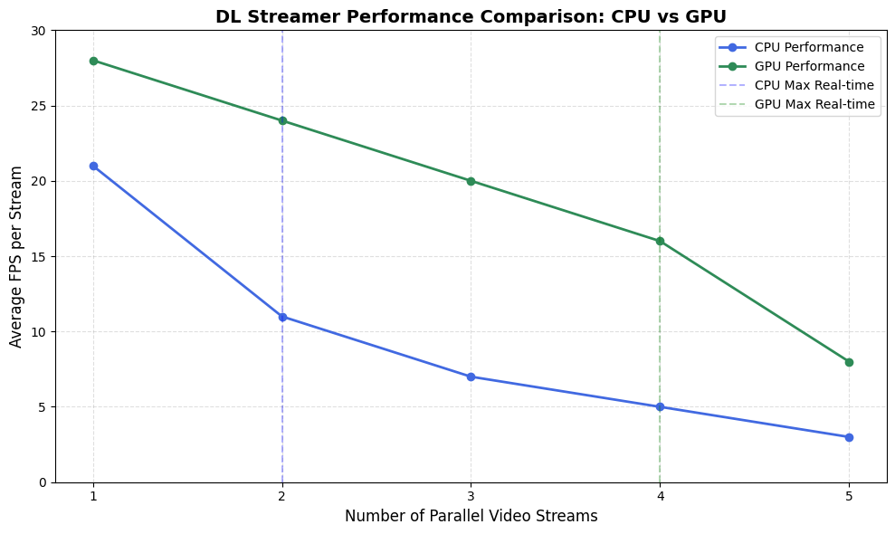
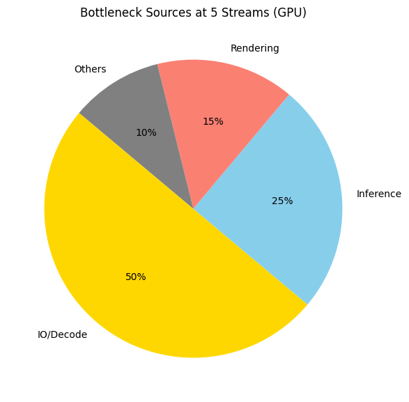

# Intel Unnati DL Streamer Project – Aashwika Khurana

## 🎯 Problem Statement
Create a pipeline (detect, decode and classification) using DL Streamer and define system scalability for Intel HW.

## 🚀 Project Summary
- Real-time object detection across multiple video streams
- Simulates a smart hospital using DL Streamer + OpenVINO
- Benchmarks on Intel Core i7 CPU and Iris Xe GPU
- Identifies scalability limits and performance bottlenecks
- Includes visual graphs for FPS, resource usage, and decoding delays

## 🏥 Real-World Scenario
A smart hospital monitoring system using DL Streamer to detect people, vehicles, and bikes in real time, with classification and multi-stream scalability.

## 🛠️ Tools & Technologies Used
- Intel® DL Streamer
- OpenVINO™ Toolkit
- GStreamer
- Intel® Core i7 CPU with Iris Xe GPU
- Ubuntu 22.04
- Diagnostic tools: `htop`, `intel_gpu_top`, `iotop`

## 📊 Benchmark Summary

| Mode | Max Streams | Avg FPS/Stream | Bottleneck |
|------|-------------|----------------|------------|
| CPU  | 2           | ~11 FPS        | Compute    |
| GPU  | 4           | ~17 FPS        | IO/Decode  |

## 📎 Files Included
- `Intel_Unnati_Aashwika_Khurana.pdf` – Final project report
- `images/` – Screenshots and visual outputs (optional)

## 🧠 Key Insights
- DL Streamer with OpenVINO enables real-time classification.
- CPU handles 2 streams, GPU handles 4.
- IO becomes bottleneck beyond 4 streams.
- Tools like `htop`, `intel_gpu_top`, and `iotop` help diagnose performance.

### 📊 Performance Snapshot

### 💡 Bottleneck Analysis

## 👤 Author
**Aashwika Khurana**  
GITAM, Hyderabad  
Email: akhurana@gitam.in

